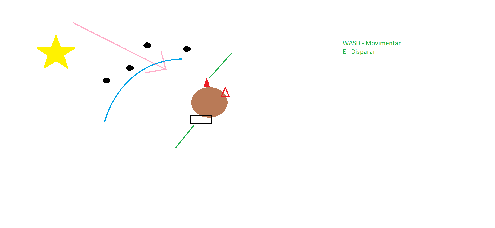

# Meteor Mayhem

Meteor Mayhem is a fast-paced 2D co-op game designed for Python Game Jam #4. Partner up to defend your planet, enhance your spaceship, and obliterate a massive asteroid on a collision course with Earth. Will you avert "The END?" Join the fun to find out!

## Table of Contents
1. [Project Diagram](#project-diagram)
2. [Project Board](#project-board)
3. [Game Jam Website](#game-jam-website)
4. [Installation & Running](#installation--running)
5. [For Developers](#for-developers)
6. [Creating the Executable](#creating-the-executable)
7. [Instructions Screenshots](#instructions-screenshots)
8. [Progress Screenshots](#progress-screenshots)

## Project Diagram
Access the game's architecture and flow diagram [here](https://app.diagrams.net/#G1nsLd9JeE7rMO8jwjvZlMnjNApgCc7dCh).

## Project Board
Monitor the development progress [here](https://github.com/users/marcelo-rg/projects/2/views/2).

## Game Jam Website
Participate in the jam or explore other projects on the [Itch.io Jam URL](https://itch.io/jam/python-game-jam-4).

## Installation & Running
To install and run the game, follow these steps:

```bash
pip install -r requirements.txt
python3 main.py
```

# Only for Devs
```bash
pip3 install cx_Freeze
```

# Creating the Executable
```bash
python3 ExeCreator.py build
```

**Instructions Screenshots**
======
## Player Movement


## Spaceship Movement


## UI


## Shooting


## Repairing


## Upgraded Spaceship


**Progress Screenshots**
======
## Main Menu


## Level Select


## Options Menu


## Level One


## Player One Idle


## Player Two Idle


## Player One Run


## Player Two Run


## First Image


## Asteroid Gif

